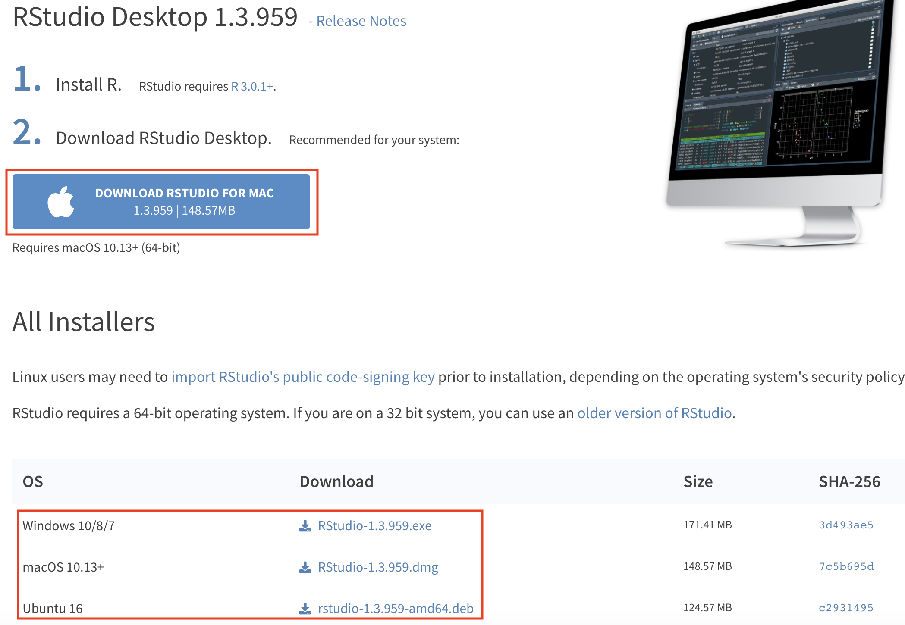
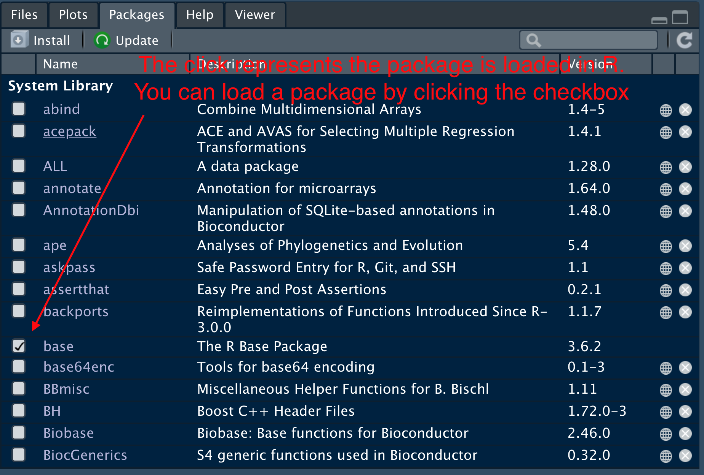

```{r setup, include=FALSE}
library(learnr)
knitr::opts_chunk$set(echo = TRUE)
```

[](https://preventivemedicine.usc.edu/education/summer-programs/lasbest/)

## Welcome


Welcome to the LA's BEST R tutorial! In this hands-on Lab you will be introduced to R, one of the most popular programming languages in the world of data. 

R is a high-level computer language developed by Ross Ihaka and Robert Gentleman in 1993. It provides a comprehensive toolkit for statistical analysis and data visualization, as well as a variety of tools to present and share your analyses  (publication quality graphics, LaTeX-style documentation, interactive shiny apps, ...). One of the most useful features of R is a user-friendly library management system. You can extend R's functionality by installing *packages* into your library (which will be covered later). With the help of *packages*, you can not only conduct the most cutting-edge data analysis, but also create animation plots, write books and build your own personal website. R is completely free!

](images/example of plot.png){width=400px}

This tutorial will cover the basics of R for beginners from different backgrounds. No prior knowledge is required. R is not hard, but like learning any new language (computer or human) it can be a bit frustrating at first. Your effort will be ample rewarded though by the acquisition of this remarkably powerful tool!


## Installing R and Rstudio
This tutorial is fully online and you don't need R or Rstudio installed to run it (Rstudio is a user-friendly tool sitting on top of R that makes it easier to run R). However, since you will need R and Rstudio throughout LA's BEST, we will guide you through the installation of R on your computer. To install R go directly to the official website of R, called [CRAN](https://cran.r-project.org/) (the Comprehensive R Archive Network). 

{width=400px}

### If you are using Windows OS
Click `Download R for Windows`, then download the `base` file. You will get a file named `R-x.x.x-win.exe` or something similar, depending on the version of the R you've download. Don't worry about the slight difference in the version of R since most of the statistical analysis are stable. Next, double click the `exe` file to initialize installation. We suggest you use the default setting for installation (simply click `Next`).

{width=500px}

### If you are using Mac OS
Click `Download R for (Mac) OS X`, then download the latest `pkg` file. Install the `pkg` file and with the default options. You might need to enter your system password during the installation process.

{width=500px}


### Install Rstudio
Now you've already have R on your laptop. However, the default R editor is hard to use. To enjoy a more user-friendly editor of R, let's install Rstudio, the most popular and powerful IDE (Integrated Development Environment) of R. Go to the official website of [Rstudio](https://rstudio.com/products/rstudio/download/#download). usually, it will automatically detect your operating system (OS) and choose the suitable installation package for you. If not, scroll down the page and choose the file accordingly.

{width=500px}

## Introduction to Rstudio
The goal of this section is to learn how to write and edit R code, organize files and read output from Rstudio. As mentioned before, Rstudio is the most popular IDE of R. An IDE is a software application that provides  comprehensive facilities to computer programmers for software development. Rstudio has many features especially designed for statisticians and data scientists. 


A typical Rstudio interface looks like this:

{width=600px}

The interface can be divided into 4 working areas: R Scripts, console, environment (where you can easily view the data and variables you've created) and a combination of file navigator, plot viewer and help file. Let's check them one by one.

### Section A: R Scripts
An R script is file with R code that you can run, modify, and keep for future use. It is similar to a `.do` file in STATA or `.sas` file in SAS. As you write a new script you can test it by running it on the R console. To create a new R script,  go to the menu bar and select `File -> New File -> R script`. Don't forget to save the changes once you modified your script.

#### Commenting Code
It's always a good idea to document your code. This means adding comments for your future self or for others describing what key portions of your code do. In a R script, `#` tells R that the strings after it are comments instead of executable R code.You might have noticed that the color of word behind the pound sign `#` is different from the rest.  Comments can document your thoughts, organize code structure and help other researchers understand your work. Good comments  can make your life much, especially when dealing with a large project. Here are some useful tips regarding [how to comment code](https://www.elegantthemes.com/blog/wordpress/how-to-comment-your-code-like-a-pro-best-practices-and-good-habits)

### Section B: Console
This tab works exactly as if you had directly opened the R software installed on your computer, without Rstudio. The console is the place where R code is run, and the results and messages  (such as warnings and errors) R returns, are displayed. A typical coding/analysis R session involves writing a script, testing it as you go along by running portions of it on the console, and finally saving your work at the end of the session. For example, if we type `print("Hello World")` in the new script file you just created, select the code and click the `Run` button. The console will display the selected code along with the output R generated. 

#### Shortuct for running R code
You can run selected R code using `Command + Return` on a Mac and `Ctrl + Enter` on a  PC. If you don select any code the same shortcut will run the line of code the cursor is on. Another useful shortcut in console is the `up` (arrow), which retrieves your previously run code.

{width=400px}

### Section C: Environment
This tab shows all the objects you've created in R. For example, if we continue typing code in your R script and executing it, you will see the how the objects you created are displayed in the environment tab. You can click the button in the red circle to view the data in a data editor.

{width=600px}

### Scetion D
#### File navigator
We often need to deal with many datasets and many R scripts located on different folders. A convenient way to find and load these data and R script efficiently is to use the `Files` navigator in Rstudio.

{width=300px}

As an example, download the graduate admission data to your computer from [UCLA IDRE](https://stats.idre.ucla.edu/stat/data/binary.csv). Save this file to a folder you can easily access. For example, I saved it to the `Downloads` folder. Then I click the `Downloads` folder, I can find the data I downloaded just now.

{width=300px}

Once we downloaded a dataset we need to get it into R for analysis. To do this we first have to set our working directory.

#### Set working directory
`Working directory` is an important concept in R (or any other programming language). Basically, it is the folder that R currently operates in. By default, R can only 'see' the files in the `working directory`, unless you specify an absolute path to the file (an absolute path is the unique location of a file on your computer). You can check your working directory by typing `getwd()` in the console and hitting return to execute it. For example, my current working directory is `~/Dropbox/Study_USC/LA_BEST/LA-BEST-TA`. The graduate data is a comma separated file or `csv` in the `Downloads` foolder. I can read it into R using the function `read.csv`. (R has a variety of functions to read different type of data. For further reference, check the tutorial on [Data import in R](https://www.datacamp.com/community/tutorials/r-data-import-tutorial). If type the file name `binary.csv` in the `read.csv` function, R will return an error message! 

{width=300px}

Why? Because the data is located in a different folder which is not our current working directory, so R cannot 'see' this file. To fix the error, we can either specify the `absolute path` (right click the file/folder and choose 'get info' to see the absolute path) to tell R where to find the file we want:
```{r, eval=FALSE}
grad <- read.csv("~/Downloads/binary.csv")
```

or we can change our working directory to the folder where the data is stored. To do so, use the file navigator to open the folder where you saved `binary.csv`, the file with the graduate admission data. Click the `More` button and select `Set As Working Directory`.

{width=400px}

Now retype the code `grad <- read.csv("binary.csv")` in your console and hit return. Is the error message gne?

*Suggestions*: Each time you launch R, use `getwd()` to check the current working directory and change your working directory if necessary. 


### Plots
This `Plots` tab display the graphs you created in R. (If your code creates a graphic object in R, Rstudio will present it automatically in the `Plots` tab, instead of in the console). For example, 

{width=450px} 

### Packages
An `R package` is a collection of R programs, data, and documentation which is shareable among R users. R packages implement new functionality, like a set of function to perfom a new type of data analysis not available from base R (base R is the basic set of functionality R comes with). The ability to use packages is one of the most useful features of R. You can regard them as add-ons to R which makes R more powerful to deal with more challenging tasks. R developers publish their packages on several repository websites. The most commonly used website is `CRAN`, which is built in with base R. Currently, `CRAN` stores more than 15,000 packages. To install packages directly from `CRAN`, simply type the type the code below in the console,
```{r eval=FALSE}
install.packages("package name") # just put in the package name you want to install in the quotation marks.
```

Another option to install package is to click the button `install` in the `Packages` tab and type the package name you want to load.

Other common repositories of R packages are `github` and `bioconductor`. To learn more about installing packages from these two repositories, please refer to [install packages from github](https://www.displayr.com/installing-r-packages-from-github/) and [install packages from bioconductor](https://www.bioconductor.org/install/).

Note that you can only use a package after you load it into your workspace. To load a package, type `library(pakcage.name)` in the console or simple check the checkbox in the `Packages` tab.

{width=400px}

### Help
If you need any help, click the `Help` tab and search for help documentation in the search box. Or you can directly type `?` before the function to open the help file. For example, if you want to know more about the `mean` function, run `?mean` in the console tab.

{width=450px}
## Basic Commands

### Variables
One of the most basic things we may want to do is to store data into an object. In R, there are different kind of objects or data structures that one can use to store not only data, but the results of fitting a statistical model, plots, predictions, and basically any R output. To create a 'variable' just come up with a unique name then assign it value to it by using the assignment operator `<-` or `=` (the two forms are equivalent). A variable name can be a combination of a character, number, `.` and `_`, however, it should start with a character.
```{r }
year <- 2022
program <- "LAs.BEST"
```

We created 2 types of variables: one is a numeric variable named `year` and the other is a character variable whose name is `program`. In R, any value quoted by `"` or `'` is treated as character. Now try to create some variables and display them in the console.
```{r variable, exercise=TRUE, exercise.lines=4}
lastyear <- 2021
lastyear
```


### Functions
R functions perform specific tasks. We rely on functions to manipulate variables and perform data analysis. R comes with many built-in functions and we can also create our own. For example, the function `rep()` is a useful built-in function which replicates a variable multiple times. Let's replicate `year` 3 times.
```{r}
rep(year, 3)
```
It's important to read the help file when you encounter a new function that don't know how to use. To get help, type `?function.name` in the console or directly search it in the `Help` tag of the Rstudio.

Type `?paste` in the Rstudio console, read the help file and use paste to print the concatenated content of  the variables `year` and `program`.
```{r paste, exercise=TRUE, exercise.lines=4}
paste()
```

### Operators
There are 2 types of operators in R, arithmetic and logical operators. 

Arithmetic | Description | Logical | Description
-----------|-------------|---------|-------------
`+` | addition | `<`  (`<=`) | less than (or equal to)
`-` | subtraction | `>`  (`>=`) | greater than (or equal to)
`*` | multiplication | `==` | exactly equal to
`/` | division | `!=` | not equal to
`^` | exponentiation | `!` | negation
`%%`| modulus        | `|` | OR
`%/%`| integer division | `&` | AND

Arithmetic operators can only be applied to numeric variables. One exception is `==`, which can compare both numeric and character variables. Try the operators in the exercise with the provided variables or create new variables yourself. Try to figure out what modulus and integer division do. 
```{r operators, exercise=TRUE}
a <- 10
b <- 3
c <- log(6) # this function computes natural logarithms of 6
a + b
a^2
b > c
# try modulus and integer division

```


## Data Frames

**Data frame:** A data frame is the basic R object to store 'rectangular' data consisting of observations in the rows and variables in the columns. The variables in a data frame can be of different type (numeric, character, factor, etc.). (guru99)

### Creating a data frame 

Run the following code to create and print a data frame:

```{r dfs, exercise=TRUE}
# Create a, b, c, d vectors
a <- c(10,20,30,40)
b <- c('book', 'pen', 'textbook', 'pencil_case')
c <- c(TRUE,FALSE,TRUE,FALSE)
d <- c(2.5, 8, 10, 7)

# Join the variables to create a data frame
df <- data.frame(a,b,c,d)
df
```

### Naming columns 

The following code renames the columns as:

+ a = cat 
+ b = dog 
+ c = mouse 
+ d = sheep

Edit the code so that the variable names more meaningfully reflects there content:

```{r df_create, include=FALSE}
# Create a, b, c, d variables
a <- c(10,20,30,40)
b <- c('book', 'pen', 'textbook', 'pencil_case')
c <- c(TRUE,FALSE,TRUE,FALSE)
d <- c(2.5, 8, 10, 7)

# Join the variables to create a data frame
df <- data.frame(a,b,c,d)
```

```{r dfs_name, exercise=TRUE, exercise.setup="df_create"}
names(df) <- c("cat", "dog", "mouse", "sheep")
df
```

```{r dfs_name-solution}
names(df) <- c("ID", "items", "in-store", "price")
df
```


### Selecting rows and columns

We can choose to only use certain portions of a data frame by selecting rows and columns. For example to select the element in row 1, column 2 of the data frame named `df` you can use `df[1,2]`.

Print out the third row of the price column:
```{r df_create2, include=FALSE}
# Create a, b, c, d variables
a <- c(10,20,30,40)
b <- c('book', 'pen', 'textbook', 'pencil_case')
c <- c(TRUE,FALSE,TRUE,FALSE)
d <- c(2.5, 8, 10, 7)

# Join the variables to create a data frame
df <- data.frame(a,b,c,d)

names(df) <- c("ID", "items", "in-store", "price")
```

```{r object_select, exercise=TRUE, exercise.setup="df_create2"}

```

```{r object_select-solution}
df[3, 3]
```

You can also select the first entire row with `df[1, ]` or the entire first column with `df[ , 1]`. You can also select columns by their name using the `$` operator, e.g. `df$ID`.

Change the following code to select the items column:
```{r df_create3, include=FALSE}
# Create a, b, c, d variables
a <- c(10,20,30,40)
b <- c('book', 'pen', 'textbook', 'pencil_case')
c <- c(TRUE,FALSE,TRUE,FALSE)
d <- c(2.5, 8, 10, 7)

# Join the variables to create a data frame
df <- data.frame(a,b,c,d)

names(df) <- c("ID", "items", "in-store", "price")
```

```{r column_select, exercise=TRUE, exercise.setup="df_create3"}
df$price
```

```{r column_select-solution}
df$items
```


### Append a column

After we create a data frame, we can add a new column. We do this by creating a vector containing the new column and then appending it to the end of the data frame.

The following code creates a vector called "quantity" and adds it to the data frame as a column. Modify the code below to create a vector called "student" which contains true/false values:

```{r df_create4, include=FALSE}
# Create a, b, c, d variables
a <- c(10,20,30,40)
b <- c('book', 'pen', 'textbook', 'pencil_case')
c <- c(TRUE,FALSE,TRUE,FALSE)
d <- c(2.5, 8, 10, 7)

# Join the variables to create a data frame
df <- data.frame(a,b,c,d)

names(df) <- c("ID", "items", "in-store", "price")
```

```{r newcolumn, exercise=TRUE, exercise.eval=TRUE, exercise.setup="df_create4"}
# Create a new vector
quantity <- c(10, 35, 40, 5)

# Add `quantity` to the `df` data frame
df$quantity <- quantity
df
```

```{r newcolumn-solution}
# Create a new vector
quantity <- c(10, 35, 40, 5)

# Add `quantity` to the `df` data frame
df$quantity <- quantity
df

student <- c(T, F, T, F)
df$student <- student
df
```

### Quiz

```{r quiz, echo=FALSE}
quiz(
  question("Choose all that apply. How can I select the second column (named bp) of a data frame?",
    answer("df$bp", correct=T),
    answer("df[2, ]"),
    answer("df[ , 2]", correct=T),
    answer("df[2, 2]")
  )
)
```

## Factor Variables

**Factor:** Factors are R's vectors to store of categorical variables. A categorical  variable can only have a few possible values.

Examples:

* Sex $\in$ \{Male, Female\}
* Asthma $\in$ \{Yes, No\}
* Age category $\in$ \{0-10, 11-20, 21-30, 31-40, >40\}

We'll use the `mtcars` dataset to look at factor variables. Run the following code to look at the structure of the dataset:

```{r datasetstructure, exercise=TRUE}
str(mtcars)
```

All of the variables are coded as numeric, but if we look at the values of these variables, some of them could be categorical (i.e. in this case the numbers are only labels for the categories and do not have a quantitative meaning, e.g. female=0, male =1). The following variables are categorical: 

* cyl = Number of cylinders; values $\in$ \{4, 6, 8\}
* vs = Engine; values $\in$ \{0=V-shaped, 1=straight\}
* am = Transmission; values $\in$ \{0=automatic, 1=manual\}
* gear = Number of forward gears; values $\in$ \{3, 4, 5\}
* carb = Number of carburetors; values $\in$ \{1, 2, 3, 4, 6, 8\}

(Some, like `carb` can be interpreted as either categorical or quantitative)

Let's focus on the number of cylinders and engine type. To work with these variables, we need to change them into factors. The basic syntax for the `factor()` function is this: ``factor(x = character(), levels, labels = levels, ordered = is.ordered(x))``

* *x* should be a vector of data to change into a factor
* *levels* is the possible values of x
* *labels* are the labels to place on these levels
* *ordered* tells us whether there is an inherent ordering to the levels

The `gear` variable has a very similar structure to the `cyl` variable. Augment the following code to make it work for the `cyl` variable:

```{r factor_nolabel, exercise=TRUE}
mtcars$gear <- factor(mtcars$gear, levels=c(3,4,5), ordered=T)
```

```{r factor_nolabel-solution}
mtcars$cyl <- factor(mtcars$cyl, levels=c(4,6,8), ordered=T)
```

We didn't use labels for this one since the labels would just be the same as the levels. 

The `am` variable has a very similar structure to the `vs` variable. Augment the following code to make it work for the `vs` variable:

```{r factor_label, exercise=TRUE}
mtcars$am <- factor(mtcars$am, levels=c(0,1), labels=c("automatic","manual"), ordered=F)
```

```{r factor_label-solution}
mtcars$vs <- factor(mtcars$vs, levels=c(0,1), labels=c("V-shaped","straight"), ordered=F)
```

Now look at the structure of the dataset again and see what's changed.

```{r datasetstructure2, exercise=TRUE, exercise.eval=TRUE}

```

```{r datasetstructure2-solution}
str(mtcars)
```

Why does it matter? It's important to have variables in their correct form when using modeling functions (e.g. linear regression), and to create graphs.


## Plot
In this section, we will use the `mtcars` data set to show how to plot in R. Let's read in the data and recode the categorical variables. This data set was extracted from the 1974 Motor Trend US magazine, and comprises fuel consumption and 10 aspects of automobile design and performance for 32 automobiles (1973–74 models).  
```{r}
data("mtcars")
mtcars <- within(mtcars, {
   vs <- factor(vs, labels = c("V", "S"))
   am <- factor(am, labels = c("automatic", "manual"))
   cyl  <- ordered(cyl)
   gear <- ordered(gear)
   carb <- ordered(carb)
})
```

### 1. Scatter plot
A scatter plot can reveal the the relationship (or lack of) between two variables. For `mtcars`, `hp` represents the horsepower of the automobiles and `qsec` is the 1/4 mile time. We now use a scatter plot to explore the relationship between these two variables.
```{r}
plot(mtcars$hp, mtcars$qsec)
```

As power increases, the time the vehicle spends on 1/4 mile decreases. Or we can say the 1/4 mile time is negatively associated with power.

Now it's your turn to explore the relationship between miles per gallon (`mpg`) and horse power (`hp`).
```{r scatter, exercise=TRUE}

```

```{r scatter-solution}
plot(x = mtcars$mpg, y = mtcars$hp)
```

### 2. Histogram
A histogram is a graphical display of quantitative variables using bars of different heights to visualize their the number of observations in each specific data range or 'bin'. We can use histogram to determine the distribution of the variable of interest. For example, let's plot the histogram of `mpg` by function `hist`.

```{r}
hist(mtcars$mpg)
```

We can change the label, title and the color of specifying a few additional parameters.
```{r}
hist(mtcars$mpg, main = "Histogram of miles per gallon", xlab = "miles per gallon (mpg)", col = "blue")
```

The parameter `main` creates a custom title, `xlab` specifies the label of the x-axis and `col` changes the fill color of the bar. Many of these parameters are common to other plotting functions in R. Refer to [Graphical Parameters](https://www.statmethods.net/advgraphs/parameters.html) for more details.

Next, plot the histogram of horse power `hp`. Specify the histogram title as "Horsepower distribution" and the label of x-axis as "horse power". Fill the bar by color "red". Does the shape of histogram of horse power differ from that of the `mpg`?
```{r hist, exercise=TRUE}

```

```{r hist-solution}
hist(mtcars$mpg, main = "Horsepower distribution", xlab = "horsepower", col = "red")
```

### 3. Boxplot
A boxplot is another method for visualizing the distribution of a numerical variable. A boxplots highlights the 25% percentile, the median (50% percentile), the 75% percentile, and it also gives  a sense of the range of the data and whether there maybe outlier observations. For example, we can create a boxplot of pooled `mpg` by using the function `boxplot`
```{r}
boxplot(mtcars$mpg, main = "Boxplot of mpg")
```

Boxplots can be be also created for subgroups to compare their distributions. For example, to generate boxplots of `mpg` by the number of cylinders `cly` we use:

```{r}
boxplot(mpg ~ cyl, data = mtcars, main = "Boxplot of mpg by cylinder group", xlab = "Number of Cylinders", ylab = "Miles Per Gallon")
```

Here `mpg ~ cyl` represents creating a boxplot of mpg by group of cylinders. Parameter `data` tells the function `boxplot` which data set we want to use. (Notice that `ylab` works as `xlab` but for labeling the y-axis.)

Now let's explore the relationship between horsepower and number of cylinders. Make sure you specify the labels of the x-axis and y-axis and also include a title for your boxplot.

```{r boxplot, exercise=TRUE}

```

```{r boxplot-solution}
boxplot(hp ~ cyl, data = mtcars, main = "Boxplot of horsepower by cylinder group", xlab = "Number of Cylinders", ylab = "Horsepower")
```

### 4. Barplot
Barplots are used to visualize/summarize categorical variables. However, before we use the function `barplot` in R, we need to first create a count table for the categorical variable. This is achieved by the function `table()`.
```{r}
counts <- table(mtcars$gear)
counts
```
15 automobiles have 3 forward gears, 14 have 4 and only 5 have 5. Now we can use the `barplot()` function to create barplot.
```{r}
barplot(counts, main="Barplot of forward gear",
   xlab="Number of Gears")
```

Try to find out which 5 vehicles have 5 forward gears and then generate a barplot for the number of carburetors `carb`.
```{r barplot, exercise=TRUE}
# which vehicle has 5 forward gears?

# barplot for carb

```

```{r barplot-solution}
# which vehicle has 5 forward gears?
mtcars[mtcars$gear == 5, ]
# barplot for carb
counts <- table(mtcars$carb)
barplot(counts, main="Barplot of number of carbs",
   xlab="Number of carbs")
```


## R Markdown
### Overview
A markup language is a a standardized set of 'marks' or notations used to annotate a plain-text document's content to give information regarding the structure of the text or instructions for how it is to be displayed. A markdown language is a light-weight markup language. R markdown is a markdown language tailored for R users. It is used to generate reproducible reports including text, analysis results, graphs, equations, etc. that can be easily updated/modified and to shared with others. Here, I'll show you  examples of R markdown reports and the workflow of the R markdown system.

### Installation
Like many other functionality in R, R markdown is also wrapped in the form of package. To install it from CRAN, use the following:
```{r eval=FALSE}
install.packages("rmarkdown")
```

### Step 1: Create a new R markdown file
To begin with, create a new R markdown file by clicking on `File` and selecting `New File` -> `R Markdown` and choosing type `Document`. By default, the file rendered by R markdown is an html file which could be viewed in a web browser. You can also select a pdf or Word document formats. However, there might be some formatting issues in pdf or Word so the html output is tipycally best.

{width=500px}

### Step 2: Write your R markdown document
Any plain text you write in the markdown file will be rendered as text. The addition of special symbols to the text will change its appearance to  be rendered as bold text, a web links, a title, etc. For example, `## R Markdown` is rendered into a header in the output. The most important feature of R markdown is that it allows the inclusion of R code. You can insert an R code 'chunk' by `control + option + I` on Mac or `shift + alt + I` in Windows (or clicking on the `Code` tab and selecting `Insert Chunk`). A code chunk can be integrated into the output along with regular text. For example, we summarize the `cars` data in the code chunk by calling the function `summary`. After rendering it into an html file, we can see the original R code and the summary of `cars`. 

{width=500px}

### Step 3: Knitting the R markdown file 
When you are done with your work you can render the R markdown file into a high quality report. Click the 'Run Document` button. The `R Markdown` tab will display a log during rendering. If there are any bugs in your code, the log will tell you where it is. You can then go back to your R markdown to correct any errors. Once you succeed, R studio will open another window to display the output.

{width=500px}

### Insert math equations
R markdown supports LaTeX syntax (LaTeX is a special markup language for writing math). The text between two dollar signs will be treated as LaTeX. For example, `$\sum_i p_i = 1$` will be rendered into $\sum_i p_i = 1$ in the output file. It takes a bit of effort at first to learn LaTeX, but once you master the basics, you will find it extremely convenient to present any math in your report together with regular text, your code, and plots. For a brief tutorial on  LaTeX, you can refer to the [help page of Overleaf](https://www.overleaf.com/learn/latex/mathematical_expressions), which is a popular online LaTeX editor.

### Further references
1. A [video demo](https://www.youtube.com/watch?v=DNS7i2m4sB0) on R markdwon by Roger Peng
2. [Official syntax reference of R markdown](https://rstudio.com/wp-content/uploads/2015/03/rmarkdown-reference.pdf?_ga=2.253189193.1176129760.1594402129-1703257209.1582172301)