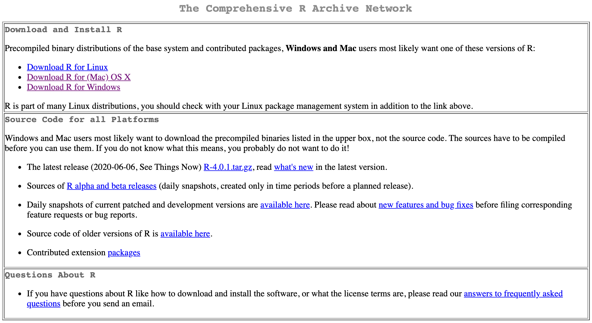
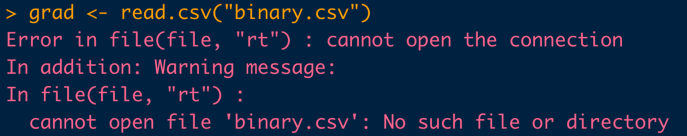
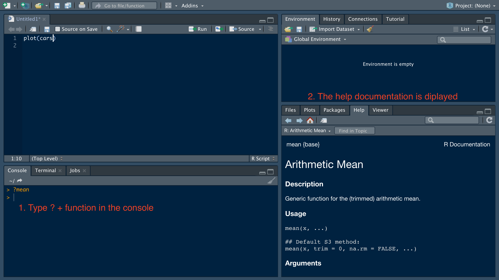

```{r setup, include=FALSE}
library(learnr)
knitr::opts_chunk$set(echo = TRUE)
```


## Welcome
Welcome to the LA's BEST summer camp! In this lab, we will learn R, one of the most popular programming languages in the world of data. 

R is a high-level computer language developed by Ross Ihaka and Robert Gentleman in 1993. It provides a comprehensive tool kits of statistical analysis and a variety of communicating techniques to present and share the work (graphics of publish quality, LaTeX-style documentations, interactive shiny apps, ...). The most exciting feature of R is a user-friendly library management system. You can extend R functionality by install *packages* into your library (which will be covered later). With the help of *packages*, you can not only conduct the most cutting-edge data analysis, but also create animation plots, write books and build your own personal website.

](images/example of plot.png){width=400px}

This tutorial will cover the basic stuff of R for beginners of diverse background. Don't worry, no prior knowledge is required to learn R. R is not hard and full of fun!


## Install R and Rstudio
To dive into the world of R programming, firstly, you need to install R on your computer and set up the coding environment. Go directly to the official website of R, which is called [CRAN](https://cran.r-project.org/) (the Comprehensive R Archive Network).

{width=400px}

### If you are using Windows OS
Click `Download R for Windows`, then download the `base` file. You will get a file named `R-4.0.1-win.exe` or something similar, depending on the version of the R you've download. Don't worry about the slight difference in the version of R since most of the statistical analysis are stable. Next, double click the `exe` file to initialize installation. It is suggested to use the default setting for installation (simply click `Next`).

{width=500px}

### If you are using a Mac OS
Click `Download R for (Mac) OS X`, then download the latest `pkg` file. Install the `pkg` file and leave the options as default. You might need to enter your system password during the installing process.

{width=500px}


### Install Rstudio
Now you've already had R on your laptop. However, the default R editor is hard to use. To enjoy a more user-friendly editor of R, let's install Rstudio, the most popular and powerful IDE (Integrated Development Environment) of R. Go to the official website of [Rstudio](https://rstudio.com/products/rstudio/download/#download). usually, it will automatically detect your OS and choose the suitable installation package for you. If not, scroll down the page and choose the file accordingly.

{width=500px}

## Introduction to Rstudio
The goal of this part is to learn how to write codes, organize files and read outputs from Rstudio. As mentioned before, Rstudio is the most popular IDE of R. The so called IDE is a software application which provides with comprehensive utilities to users for computing and programming. Rstudio contains a lot of features especially designed for data scientist. 


A typical Rstudio interface looks like this:

{width=600px}

It can be divided into 4 working areas: R Script, consoles, environment (where you can easily view the data and variables you've created) and a combination of file navigator, plot viewer and help file. Let's check them one by one.

### Section A: R Script
An R script is a executable file which document all the codes of your work. You can regard it as the `.do` file in STATA or `.sas` file in SAS. During the workflow, it is suggested to keep a record of the code in the script and then test the code in R console. To create a new R script, you can go to the menu bar and select `File -> New File -> R script`. Don't forget to save the changes once you modified the codes in your script.

#### Commenting Codes
Always remember to annotate your codes! You might have noticed that the color of word behind the pound sign `#` is different from the rest. In a R script, `#` tells R the strings behind it are comments to the script instead of executable R codes. Comments can document your thoughts, organize code structure and help other researcher understand your work. Good practice of comments facilitate your coding stuff and makes life much easier, especially when you are dealing with a large project. Here are some useful tips regarding [how to comment codes](https://www.elegantthemes.com/blog/wordpress/how-to-comment-your-code-like-a-pro-best-practices-and-good-habits)

### Section B: Console
This tab is exactly the same as you directly open the R software installed on your computer. Console is the place where R codes are executed. It also displays the results and messages (such as warnings and errors) the codes return. A typical workflow of coding is to write the codes in the script, test them in the console and then save your work. For example, if we type `print("Hello World")` in the script, select the codes and click the `Run` button, the console will display the selected codes along with their output. 

#### Shortuct of running R codes
The shortcut for running selected codes is `Command + Return` in Mac and `Ctrl + Enter` in Windows. You can also use the shortcut to run the codes line by line without selecting. Another useful shortcut in console is `up`, which could retrieve your previous codes.

{width=400px}

### Section C: Environment
This tab stores all the objects (values, model, data and etc...) that you've created in R. For example, if we continue typing codes in your R script and executing the codes, you will see the objects you created are displayed in the environment tab. You can click the button in the red circle to view the data in a data editor.

{width=600px}

### Scetion D
#### File navigator
In practice, we deal with a large amount of data and R scripts located in different folders. How to manage, find and load these data and R script efficiently? The easiest way is to use the `Files` navigator in Rstudio.

{width=300px}

For illustration purpose, download the graduate admission data to your laptop from [UCLA IDRE](https://stats.idre.ucla.edu/stat/data/binary.csv). Save this file to a folder you can easily access to. For example, I save it to the `Downloads` folder. Then I click the `Downloads` folder, I can find the data I downloaded just now.

{width=300px}

Now we can find the data we needed for work, how do we load the data into R for further analysis? This is related to understanding the working directory.

#### Set working directory
`Working directory` is an important concept in R (or any other programming language). Basically, it is the folder that R currently operates in. By default, R can only 'see' the files in the `working directory`, unless you specify an absolute path to the file (an absolute path is the unique coordinates of a file in the computer). You can check your working directory by running `getwd()` in the console. For example, my current working directory is `~/Dropbox/Study_USC/LA_BEST/LA-BEST-TA`. The graduate data is a `csv` file in `Downloads`, so I want to load this data by function `read.csv`. (R has a variety of functions to read different type of data. For further reference, check the tutorial on [Data import in R](https://www.datacamp.com/community/tutorials/r-data-import-tutorial)) If I directly type the file name `binary.csv` in the `read.csv` function, R will return an error message to me! 

{width=300px}

Why? Because the data is located in a different folder which is not our current working directory and R cannot 'see' this file. To fix the error, we can either specify the `absolute path` (right click the file/folder and choose property, then you may find the absolute path) to tell R where to find the file we want:
```{r, eval=FALSE}
grad <- read.csv("~/Downloads/binary.csv")
```

or we can change our working directory to the folder that stored the data. To do so, use the file navigator to open the folder you save the grad data, click the `More` button and select `Set As Working Directory`.

{width=400px}

Now retype the code `grad <- read.csv("binary.csv")` in your console, do you get rid of the error message?

*Suggestions*: Each time you launch R, use `getwd()` to check the current working directory and change your working directory if necessary. 


### Plots
This `Plots` tab display the graphs you created in R. (If your code creates a graphic object in R, Rstudio will present it automatically in the `Plots` tab, instead of in the console). For example, 

{width=450px} 

### Packages
`R package` is a collection of codes, data and documentation which is shareable among R users. It is one of the most attractive properties of R. You can regard them as add-ons to R which makes R more powerful to deal with more challenging tasks. R developers publish their packages on several repository website. The most commonly used website is `CRAN`, which is built in with base R. Currently, `CRAN` stores more than 15,000 packages. To install packages directly from `CRAN`, simply type the folloing codes in the console,
```{r eval=FALSE}
install.packages("package name") # just put in the package name you want to install in the quotation mark
```

Another option to install package is to click the button `install` in the `Packages` tab and type the package name into it.

Other famous websites storing packages are `github` and `bioconductor`. To learn more about installing packages from these two repositories, please refer to [install packages from github](https://www.displayr.com/installing-r-packages-from-github/) and [install packages from bioconductor](https://www.bioconductor.org/install/).

Note that you can only use a package after you load it into your workspace. To load a package, type `library(pakcage.name)` in the console or simple check the checkbox in the `Packages` tab.

{width=400px}

### Help
If you need any help, click the `Help` tab and search for help documentation in the search box. Or you can directly type `?` before the function to open the help file. For example, if you want to know more about the `mean` function, run `?mean` in the console tab.

{width=450px}


## Basic Command

### Variables
As future data scientist, the first thing we need to do is to store data into an object. Such object is usually called *variable* in programming. In R, a variable not only stores data, but also keeps statistical models, predictions, and basically any R output. It's simple to create a variable: just come up with a unique name then add a value to it by using `<-` or `=`. (variable name can be a combination of `character`, `number`, `.` and `_`, however, it should start with a character).
```{r }
year <- 2020
program <- "LAs.BEST"
```

We create 2 types of variables: one is numeric labeled with name `year` and the other is a character whose name is `program`. In R, any value quoted by `"` or `'` is treated as character. Now try to create some variables and display them in the console.
```{r variable, exercise=TRUE, exercise.lines=4}
lastyear <- 2019
lastyear
```


### Functions
Function is a wrapper of codes. We rely on functions to manipulate variables and conduct data analysis. Suppose we have a function named `fun`, we can call this function by type `fun()` in the console and add parameters in the parenthesis. For example, `rep()` is a useful built-in function which replicates the variables. Let's replicate `year` by 3 times.
```{r}
rep(year, 3)
```
It's important to read the help file when you encounter a new function and don't know how to use it. To get help, type `?function.name` in the console or directly search it in the `Help` tag of the Rstudio.

Type `?paste` in the Rstudio console, read the help file and use paste to concatenate year and program.
```{r paste, exercise=TRUE, exercise.lines=4}
paste()
```

### Operators
There are 2 types of operators in R, arithmetic and logical operators. 

Arithmetic | Description | Logical | Description
-----------|-------------|---------|-------------
`+` | addition | `<`  (`<=`) | less than (or equal to)
`-` | subtraction | `>`  (`>=`) | greater than (or equal to)
`*` | multiplication | `==` | exactly equal to
`/` | division | `!=` | not equal to
`^` | exponentiation | `!` | negation
`%%`| modulus        | `|` | OR
`%/%`| integer division | `&` | AND

Most operators can only be applied to the numeric variables. One exception is `==`, which can compare both numeric and character variables. Try the operators in the exercise with the provided variables or create variables by yourself. Figure out the logic of modulus and integer division. 
```{r operators, exercise=TRUE}
a <- 10
b <- 3
c <- log(6) # this function computes natural logarithms of 6
a + b
a^2
b > c
# try modulus and integer division

```


## Data Frames

**Data frame:** A data frame is a list of vectors which are of equal length. A matrix contains only one type of data, while a data frame accepts different data types (numeric, character, factor, etc.). (guru99)

### Creating a data frame 

Run the following code to create and print a data frame:

```{r dfs, exercise=TRUE}
# Create a, b, c, d variables
a <- c(10,20,30,40)
b <- c('book', 'pen', 'textbook', 'pencil_case')
c <- c(TRUE,FALSE,TRUE,FALSE)
d <- c(2.5, 8, 10, 7)

# Join the variables to create a data frame
df <- data.frame(a,b,c,d)
df
```

### Naming columns 

The following code renames the columns as:

+ a = cat 
+ b = dog 
+ c = mouse 
+ d = sheep

Edit the code so that the names make sense with the data:

```{r df_create, include=FALSE}
# Create a, b, c, d variables
a <- c(10,20,30,40)
b <- c('book', 'pen', 'textbook', 'pencil_case')
c <- c(TRUE,FALSE,TRUE,FALSE)
d <- c(2.5, 8, 10, 7)

# Join the variables to create a data frame
df <- data.frame(a,b,c,d)
```

```{r dfs_name, exercise=TRUE, exercise.setup="df_create"}
names(df) <- c("cat", "dog", "mouse", "sheep")
df
```

```{r dfs_name-solution}
names(df) <- c("ID", "items", "in-store", "price")
df
```


### Selecting rows and columns

We can choose to only use certain portions of a data frame by selecting rows and columns. Using matrix notation, you can subset the data frame `df` with the code `df[1,2]` which will select row 1 and column 2 of the data frame.

Print out the third row of the price column:
```{r df_create2, include=FALSE}
# Create a, b, c, d variables
a <- c(10,20,30,40)
b <- c('book', 'pen', 'textbook', 'pencil_case')
c <- c(TRUE,FALSE,TRUE,FALSE)
d <- c(2.5, 8, 10, 7)

# Join the variables to create a data frame
df <- data.frame(a,b,c,d)

names(df) <- c("ID", "items", "in-store", "price")
```

```{r object_select, exercise=TRUE, exercise.setup="df_create2"}

```

```{r object_select-solution}
df[3, 3]
```

You can also select the first entire row with `df[1, ]` or the entire first column with `df[ , 1]`. You can also select columns by their name and the `$` notation.

Change the following code to select the items column:
```{r df_create3, include=FALSE}
# Create a, b, c, d variables
a <- c(10,20,30,40)
b <- c('book', 'pen', 'textbook', 'pencil_case')
c <- c(TRUE,FALSE,TRUE,FALSE)
d <- c(2.5, 8, 10, 7)

# Join the variables to create a data frame
df <- data.frame(a,b,c,d)

names(df) <- c("ID", "items", "in-store", "price")
```

```{r column_select, exercise=TRUE, exercise.setup="df_create3"}
df$price
```

```{r column_select-solution}
df$items
```


### Append a column

After we create a data frame, we can add a new column. We do this by creating a vector and then appending it to the end of the data frame.

The following code creates a vector called "quantity" and adds it to the data frame as a column. Add to this code to create a vector called "student" which contains true/false values:

```{r df_create4, include=FALSE}
# Create a, b, c, d variables
a <- c(10,20,30,40)
b <- c('book', 'pen', 'textbook', 'pencil_case')
c <- c(TRUE,FALSE,TRUE,FALSE)
d <- c(2.5, 8, 10, 7)

# Join the variables to create a data frame
df <- data.frame(a,b,c,d)

names(df) <- c("ID", "items", "in-store", "price")
```

```{r newcolumn, exercise=TRUE, exercise.eval=TRUE, exercise.setup="df_create4"}
# Create a new vector
quantity <- c(10, 35, 40, 5)

# Add `quantity` to the `df` data frame
df$quantity <- quantity
df
```

```{r newcolumn-solution}
# Create a new vector
quantity <- c(10, 35, 40, 5)

# Add `quantity` to the `df` data frame
df$quantity <- quantity
df

student <- c(T, F, T, F)
df$student <- student
df
```

### Quiz

```{r quiz, echo=FALSE}
quiz(
  question("Choose all that apply. How can I select the second column (named bp) of a data frame?",
    answer("df$bp", correct=T),
    answer("df[2, ]"),
    answer("df[ , 2]", correct=T),
    answer("df[2, 2]")
  )
)
```

## Factor Variables

**Factor:** Factors are R's versions of categorical variables, meaning the variable has a limited amount of possible values and these possible values are usually contained in a finite set.

Examples:

* Sex $\in$ \{Male, Female\}
* Asthma $\in$ \{Yes, No\}
* Age category $\in$ \{0-10, 11-20, 21-30, 31-40, >40\}

We'll use the `mtcars` dataset to look at factor variables. Run the following code to look at the structure of the dataset:

```{r datasetstructure, exercise=TRUE}
str(mtcars)
```

All of the variables are coded as numerics, but if we look at the values of these variables, some of them could be factors. Potential factors:

* cyl = Number of cylinders; values $\in$ \{4, 6, 8\}
* vs = Engine; values $\in$ \{0=V-shaped, 1=straight\}
* am = Transmission; values $\in$ \{0=automatic, 1=manual\}
* gear = Number of forward gears; values $\in$ \{3, 4, 5\}
* carb = Number of carburetors; values $\in$ \{1, 2, 3, 4, 6, 8\}

Let's focus on number of cylinders and engine type. To work with these variables more appropriately, we need to change them into factors. The basic syntax for the `factor()` function is this: ``factor(x = character(), levels, labels = levels, ordered = is.ordered(x))``

* *x* should be a vector of data to change into a factor
* *levels* is the possible values of x
* *labels* are the labels to place on these levels
* *ordered* tells us whether there is an inherent ordering to the levels

The `gear` variable has a very similar structure to the `cyl` variable. Augment the following code to make it work for the `cyl` variable:

```{r factor_nolabel, exercise=TRUE}
mtcars$gear <- factor(mtcars$gear, levels=c(3,4,5), ordered=T)
```

```{r factor_nolabel-solution}
mtcars$cyl <- factor(mtcars$cyl, levels=c(4,6,8), ordered=T)
```

We didn't use labels for this one since the labels would just be the same as the levels. 

The `am` variable has a very similar structure to the `vs` variable. Augment the following code to make it work for the `vs` variable:

```{r factor_label, exercise=TRUE}
mtcars$am <- factor(mtcars$am, levels=c(0,1), labels=c("automatic","manual"), ordered=F)
```

```{r factor_label-solution}
mtcars$vs <- factor(mtcars$vs, levels=c(0,1), labels=c("V-shaped","straight"), ordered=F)
```

Now look at the structure of the dataset again and see what's changed.

```{r datasetstructure2, exercise=TRUE, exercise.eval=TRUE}

```

```{r datasetstructure2-solution}
str(mtcars)
```

Why does it matter? It's important to have variables in their correct form when using modelling commands, and it also gives a lot of extra options when creating graphs.


## Plot
In this section, we will use the `mtcars` data set to show how to plot in R. Let's read in the data and recode the categorical variables. This data set was extracted from the 1974 Motor Trend US magazine, and comprises fuel consumption and 10 aspects of automobile design and performance for 32 automobiles (1973–74 models).  
```{r}
data("mtcars")
mtcars <- within(mtcars, {
   vs <- factor(vs, labels = c("V", "S"))
   am <- factor(am, labels = c("automatic", "manual"))
   cyl  <- ordered(cyl)
   gear <- ordered(gear)
   carb <- ordered(carb)
})
```

### 1. Scatter plot
A scatter plot can reveal the patterns of correlation between two variables. For `mtcars`, `hp` represents the horsepower of the automobiles and `qsec` is the 1/4 mile time. We now use a scatter plot to explore the relationship between these two variables.
```{r}
plot(mtcars$hp, mtcars$qsec)
```

As horse power increases, the time the vehicle spends on 1/4 mile decreases. Or we can say the 1/4 mile time is negatively associated with the horse power.

Now it's your turn to explore the relationship between miles per gallon (`mpg`) and horse power (`hp`).
```{r scatter, exercise=TRUE}

```

```{r scatter-solution}
plot(x = mtcars$mpg, y = mtcars$hp)
```

### 2. Histogram
A histogram is a graphical display of continuous data using bars of different heights. The height of bar represents the number of observations in a specific data range. We can use histogram to determine the statistical distribution of the variable of interest. For example, let's plot the histogram of `mpg` by function `hist`.
```{r}
hist(mtcars$mpg)
```

We can change the label, title and the color of specifying a few additional parameters.
```{r}
hist(mtcars$mpg, main = "Histogram of miles per gallon", xlab = "miles per gallon (mpg)", col = "blue")
```

Here, `main` change the titles as you want, `xlab` specifies the label of x-axis and `col` changes the fill color of the bar. Actually, these additional parameters are shared by most generic plot function in R. Refer to [Graphical Parameters](https://www.statmethods.net/advgraphs/parameters.html) for more details.

Next, plot the histogram of horsepower `hp`. Specify the histogram title as "Histogram of horsepower" and the label of x-axis as "horse power". Fill the bar by color "red". Does the shape of histogram of horse power differ from that of the `mpg`?
```{r hist, exercise=TRUE}

```

```{r hist-solution}
hist(mtcars$mpg, main = "Histogram of horsepower", xlab = "horsepower", col = "red")
```


### 3. Barplot
Similar to the histogram, barplot exhibits the counts of a categorical variable. However, before we use the function `barplot` in R, we need to first create a count table for the categorical variable. This is achieved by the function `table()`.
```{r}
counts <- table(mtcars$gear)
counts
```
15 automobiles have 3 forward gears, 14 have 4 and only 5 have 5. Now we can use the `barplot()` function to create barplot.
```{r}
barplot(counts, main="Barplot of forward gear",
   xlab="Number of Gears")
```

Try to find out which 5 vehicles have 5 forward gear and then plot a barplot for the number of carburetors `carb`.
```{r barplot, exercise=TRUE}
# which vehicle has 5 forward gear?

# barplot for carb

```

```{r barplot-solution}
# which vehicle has 5 forward gear?
mtcars[mtcars$gear == 5, ]
# barplot for carb
counts <- table(mtcars$carb)
barplot(counts, main="Barplot of number of carbs",
   xlab="Number of carbs")
```


### 4. Boxplot
A boxplot is a method for graphically depicting groups of numerical data through their quartiles. From the bottom to the top, the line of boxplot represents minimum (excluding outliers), first quartile (Q1, or 25% percentile), median (Q2, or 50% percentile), third quartile (Q3, or 75% quartile). Boxplots can be created for individual variables or for variables by group. For example, we can create a boxplot of pooled `mpg` by using function `boxplot`
```{r}
boxplot(mtcars$mpg, main = "Boxplot of mpg")
```
Alternatively, we can create a boxplot by group. Still take the `mpg` as an example and draw boxplots of `mpg` by the number of cylinders `cly`.
```{r}
boxplot(mpg ~ cyl, data = mtcars, main = "Boxplot of mpg by cylinder group", xlab = "Number of Cylinders", ylab = "Miles Per Gallon")
```

Here `mpg ~ cyl` represents creating a boxplot of mpg by group of cylinders. Parameter `data` tells the function `boxplot` which data set we want to use. Besides, you may have noticed, `ylab` chage the label of y-axis just the same as `xlab`.

Now let's explore the relationship between horsepower and number of cylinders. Do not forget to specify the labels of the x-axis and y-axis and also add titles to your boxplot.
```{r boxplot, exercise=TRUE}

```

```{r boxplot-solution}
boxplot(hp ~ cyl, data = mtcars, main = "Boxplot of horsepower by cylinder group", xlab = "Number of Cylinders", ylab = "Horsepower")
```

## R Markdown
### Overview
R markdown is a markdown file system tailored for data science community. It could display and execute R codes and generate reproducible report that is easy to communicate and share. Here, I'll show you the examples of R markdown report and the workflow of R markdown system.

### Installation
Like many other functions of R, R markdown is also warped in the form of package. To install it from CRAN, use the following code:
```{r eval=FALSE}
install.packages("rmarkdown")
```

### Step 1: Create a new R markdown file
To begin with, create a new R markdown file by click the button in the red circle. It prompts a wizard for template. By default, the file rendered by R markdown is an html file which could be viewed in a web browser. You can also select format of output in pdf or Word document. However, there might be some format issue of the R codes along with their outputs in pdf or Word. In practice, people usually enjoy the best reading experience in the html output.

{width=500px}

### Step 2: Write your R markdown document
You can write in the markdwon file just as in MS Word. The plain text will be rendered into words while some special syntax will be rendered into title, bold text, web links etc. For example, `## R Markdown` is rendered into a header in the output. The best property of R markdown is inclusion of R codes. You can insert the executable code chunk by `control + option + I` in Mac or `shift + alt + I` in Windows. Such codes can be integrated into the output file along with their output. For example, we summarize the `cars` data in the code chunk by call the function `summary`. After rendering it into an html file, we shall see the original R codes and the summary of `cars`. 

{width=500px}

### Step 3: Knit the R markdown file and communicate your work
After finish your write up, you can render the raw R markdown file into a high quality report. Click the `knit` button in the red circle. The `R Markdown` tab will display the log during rendering. If there are any bugs in your codes, the log will tell you where it is. Then you go back to your R markdown script and debug. Once you succeed, R studio will prompt another window to display the output.

{width=500px}

### Insert math equations
R markdown support syntax of LaTeX. The text between two dollar signs will be treated as LaTeX syntax. For example, `$\sum_i p_i = 1$` will be rendered into $\sum_i p_i = 1$ in the output file. It takes a while to study the grammar of LaTeX. However, once you master it, you will find it extremely convenient to present your research work in a publishable report together with your codes and plots. For a brief tutorial of mathematical expression of LaTeX, you can refer to the [help page of Overleaf](https://www.overleaf.com/learn/latex/mathematical_expressions), which is a popular online editor of LaTeX.

### Further references
1. A [video demo](https://www.youtube.com/watch?v=DNS7i2m4sB0) of R markdwon by Roger Peng
2. [Official syntax reference of R markdown](https://rstudio.com/wp-content/uploads/2015/03/rmarkdown-reference.pdf?_ga=2.253189193.1176129760.1594402129-1703257209.1582172301)