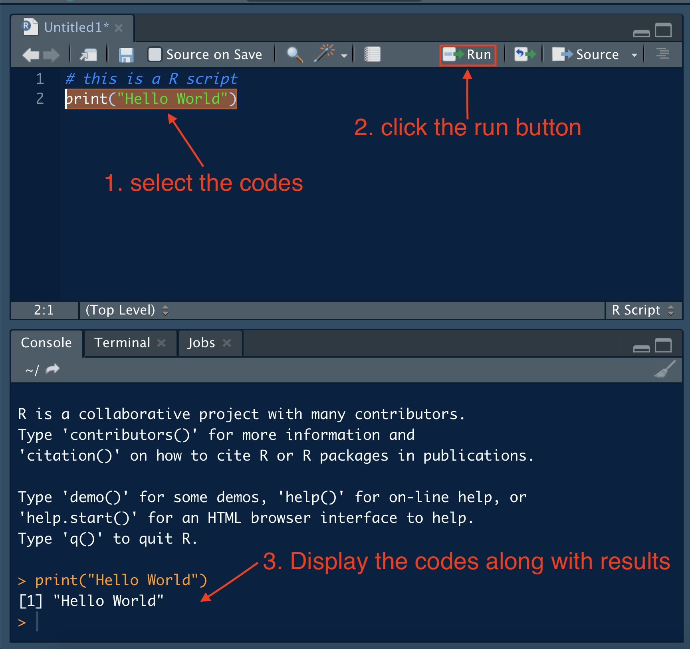
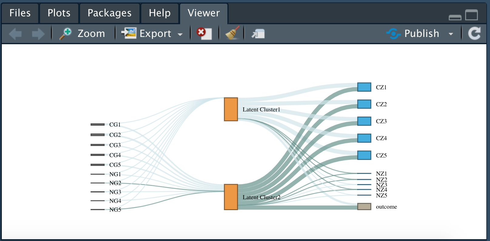

```{r setup, include=FALSE}
library(learnr)
knitr::opts_chunk$set(echo = TRUE)
```


## Introduction
Welcome to the LA's BEST summer camp! In this lab, we will learn R, one of the most popular programming languages in the world of data. 

R is a high-level computer language developed by Ross Ihaka and Robert Gentleman in 1993. It provides a comprehensive tool kits of statistical analysis and a variety of communicating techniques to present and share the work (graphics of publish quality, LaTeX-style documentations, interactive shiny apps, ...). The most exciting feature of R is a user-friendly library management system. You can extend R functionality by install *packages* into your library (which will be covered later). With the help of *packages*, you can not only conduct the most cutting-edge data analysis, but also create animation plots, write books and build your own personal website.

](images/example of plot.png){width=400px}

This tutorial will cover the basic stuff of R for beginners of diverse background. Don't worry, no prior knowledge is required to learn R. R is not hard and full of fun!

## Get started with Rstudio
Rstudio is the most popular Integrated Development Environment (IDE) of R. It is a software application which allows the user to use R language in more a user-friendly manner. A typical Rstudio interface looks like this:

{width=600px}

It can be divided into 4 working area:

* A: R script. This is the area where you keep the code of your work. It is the same as the `.do` files in STATA. It is suggested to write the code in the script and then test the code in R. To create a new R script, you can go to the menu bar and select `File -> New File -> R script`. Don't forget to save the chages once you modified the codes in your script.
* C: Console. This tab is exactly the same as you directly open the R software installed on your computer. It executes the codes written in the R script and display the messages the codes return. For example, if we type `print("Hello World")` in the script, select the codes and click the `Run` button, the console will display the selected codes along with their output. The shortcut for running selected codes is `Command + Return` in Mac and `Ctrl + Enter` in Windows.
{width=400px}
* B: Workspace tab. This area store all the objects (values, model, data and etc...) that you've created in R. For example, if we continue typing codes in your R script and executing the codes, you will see the objects you created are displayed in the workspace tab. You can click the rectangle button in the circle to view the data in a new data editor.
{width=600px}
* D: This tab provides with several functions. The `Files` tab allow you to browse files and read in data. The `Plots` tab display the graphs you created in R. {width=300px} 

`Packages` let you install and load various `R package` to assist your analysis. Note that you can only use a package after you load it into your workspace. To load a package, type `library(pakcage.name)` in the cosole or simple check the box in the `Packages` tab.

{width=300px}

If you need any help, click the `Help` tab and search for help documentation in the search box. Or you can directly type `?` before the function to open the help file. For example, if you want to know more about the `mean` function, run `?mean` in the console tab.

{width=300px}

Lastly, the `Viewer` tab displays the `html` files in your local computer or returned by R. Below is an interactive graph produced by R in a html file.

{width=300px}

### A Little More About Packages
`R package` is a collection of codes, data and documentation which is shareable among R users. It is one of the most attractive properties of R. You can regard them as add-ons to R which makes R more powerful to deal with more challenging tasks. R developers publish their packages on several repository website. The most commonly used website is `CRAN`, which is built in with base R. Currently, `CRAN` stores more than 15,000 packages. To install packages directly from `CRAN`, simply type the folloing codes in the console,
```{r eval=FALSE}
install.packages("package name") # just put in the package name you want to install in the quotation mark
```

Other famous websites are `github` and `bioconductor`. To learn more about installing packages from these two repositories, please refer to [install packages from github](https://www.displayr.com/installing-r-packages-from-github/) and [install packages from bioconductor](https://www.bioconductor.org/install/).

## Basic Command

### Variables
As future data scientist, the first thing we need to do is to store data into an object. Such object is usually called *variable* in programming. In R, a variable not only stores data, but also keeps statistical models, predictions, and basically any R output. It's simple to create a variable: just come up with a unique name then add a value to it by using `<-` or `=`. (variable name can be a combination of `character`, `number`, `.` and `_`, however, it should start with a character).
```{r }
year <- 2020
program <- "LA.BSET"
```

We create 2 types of variables: one is numeric labeled with name `year` and the other is a character whose name is `program`. In R, any value quoted by `"` or `'` is treated as character. Now try to create some variables and display them in the console.
```{r variable, exercise=TRUE, exercise.lines=4}
lastyear <- 2019
lastyear
```


### Functions
Function is a wrapper of codes. We rely on functions to manipulate variables and conduct data analysis. Suppose we have a function named `fun`, we can call this function by type `fun()` in the console and add parameters in the parenthesis. For example, `rep()` is a useful built-in function which replicates the variables. Let's replicate `year` by 3 times.
```{r}
rep(year, 3)
```
It's important to read the help file when you encounter a new function and don't know how to use it. To get help, type `?function.name` in the console or directly search it in the `Help` tag of the Rstudio.

Type `?paste` in the Rstudio console, read the help file and use paste to concatenate year and program.
```{r paste, exercise=TRUE, exercise.lines=4}
paste()
```

### Operators
There are 2 types of operators in R, arithmetic and logical operators. 

Arithmetic | Description | Logical | Description
-----------|-------------|---------|-------------
`+` | addition | `<`  (`<=`) | less than (or equal to)
`-` | subtraction | `>`  (`>=`) | greater than (or equal to)
`*` | multiplication | `==` | exactly equal to
`/` | division | `!=` | not equal to
`^` | exponentiation | `!` | negation
`%%`| modulus        | `|` | OR
`%/%`| integer division | `&` | AND

Most operators can only be applied to the numeric variables. One exception is `==`, which can compare both numeric and character variables. Try the operators in the exercise with the provided variables or create variables by yourself. Figure out the logic of modulus and integer division. 
```{r operators, exercise=TRUE}
a <- 10
b <- 3
c <- log(6) # this function computes natural logarithms of 6
a + b
a^2
b > c
# try modulus and integer division

```


## Play with Data
### Data input
Importing data into R is fairly simple. `.csv` files are the most commonly used data type in R. To input such file, we use the built-in function `read.csv`. For files with extension `.txt`, try another generic function `read.table`. 

By convention, R reads in the data in a format called `data frame`. We will deal with this format of data most of the time. It's really important to get familiar with the techniques of manipulating the `data frame`. Let's start with the basic concept of `data frame`.


### Data Frames

**Data frame:** A data frame is a list of vectors which are of equal length. A matrix contains only one type of data, while a data frame accepts different data types (numeric, character, factor, etc.). (guru99)

#### Creating a data frame 

Run the following code to create and print a data frame:

```{r dfs, exercise=TRUE, exercise.completion=T}
# Create a, b, c, d variables
a <- c(10,20,30,40)
b <- c('book', 'pen', 'textbook', 'pencil_case')
c <- c(TRUE,FALSE,TRUE,FALSE)
d <- c(2.5, 8, 10, 7)

# Join the variables to create a data frame
df <- data.frame(a,b,c,d)
df
```

#### Naming columns 

The following code renames the columns as:
1. a <- cat
2. b <- dog
3. c <- mouse
4. d <- sheep

Edit the code so that the names make sense with the data:

```{r df_create, include=FALSE}
# Create a, b, c, d variables
a <- c(10,20,30,40)
b <- c('book', 'pen', 'textbook', 'pencil_case')
c <- c(TRUE,FALSE,TRUE,FALSE)
d <- c(2.5, 8, 10, 7)

# Join the variables to create a data frame
df <- data.frame(a,b,c,d)
```

```{r dfs_name, exercise=TRUE, exercise.setup="df_create"}
names(df) <- c("cat", "dog", "mouse", "sheep")
df
```

```{r dfs_name-solution}
names(df) <- c("ID", "items", "in-store", "price")
df
```


#### Selecting rows and columns

We can choose to only use certain portions of a data frame by selecting rows and columns. Using matrix notation, you can subset the data framee `df` with the code `df[1,2]` which will select row 1 and column 2 of the data frame.

Print out the third row of the price column:
```{r df_create2, include=FALSE}
# Create a, b, c, d variables
a <- c(10,20,30,40)
b <- c('book', 'pen', 'textbook', 'pencil_case')
c <- c(TRUE,FALSE,TRUE,FALSE)
d <- c(2.5, 8, 10, 7)

# Join the variables to create a data frame
df <- data.frame(a,b,c,d)

names(df) <- c("ID", "items", "in-store", "price")
```

```{r object_select, exercise=TRUE, exercise.setup="df_create2"}

```

```{r object_select-solution}
df[3, 3]
```

You can also select the first entire row with `df[1, ]` or the entire first column with `df[ , 1]`. You can also select columns by their name and the `$` notation.

Change the following code to select the items column:
```{r df_create3, include=FALSE}
# Create a, b, c, d variables
a <- c(10,20,30,40)
b <- c('book', 'pen', 'textbook', 'pencil_case')
c <- c(TRUE,FALSE,TRUE,FALSE)
d <- c(2.5, 8, 10, 7)

# Join the variables to create a data frame
df <- data.frame(a,b,c,d)

names(df) <- c("ID", "items", "in-store", "price")
```

```{r column_select, exercise=TRUE, exercise.setup="df_create3"}
df$price
```

```{r column_select-solution}
df$items
```


#### Append a column

After we create a data frame, we can add a new column. We do this by creating a vector and then appending it to the end of the data frame.

The following code creates a vector called "quantity" and adds it to the data frame as a column. Add to this code to create a vector called "student" which contains true/false values:

```{r df_create4, include=FALSE}
# Create a, b, c, d variables
a <- c(10,20,30,40)
b <- c('book', 'pen', 'textbook', 'pencil_case')
c <- c(TRUE,FALSE,TRUE,FALSE)
d <- c(2.5, 8, 10, 7)

# Join the variables to create a data frame
df <- data.frame(a,b,c,d)

names(df) <- c("ID", "items", "in-store", "price")
```

```{r newcolumn, exercise=TRUE, exercise.eval=TRUE, exercise.setup="df_create4"}
# Create a new vector
quantity <- c(10, 35, 40, 5)

# Add `quantity` to the `df` data frame
df$quantity <- quantity
df
```

```{r newcolumn-solution}
# Create a new vector
quantity <- c(10, 35, 40, 5)

# Add `quantity` to the `df` data frame
df$quantity <- quantity
df

student <- c(T, F, T, F)
df$student <- student
df
```

#### Quiz

```{r quiz}
quiz(
  question("Choose all that apply. How can I select the second column (named bp) of a data frame?",
    answer("df$bp", correct=T),
    answer("df[2, ]"),
    answer("df[ , 2]", correct=T),
    answer("df[2, 2]")
  )
)
```


## Plot
In this section, we will use the `mtcars` data set to show how to plot in R. Let's read in the data and recode the categorical variables. This data set was extracted from the 1974 Motor Trend US magazine, and comprises fuel consumption and 10 aspects of automobile design and performance for 32 automobiles (1973–74 models).  
```{r}
data("mtcars")
mtcars <- within(mtcars, {
   vs <- factor(vs, labels = c("V", "S"))
   am <- factor(am, labels = c("automatic", "manual"))
   cyl  <- ordered(cyl)
   gear <- ordered(gear)
   carb <- ordered(carb)
})
```

### 1. Scatter plot
A scatter plot can reveal the patterns of correlation between two variables. For `mtcars`, `hp` represents the horsepower of the automobiles and `qsec` is the 1/4 mile time. We now use a scatter plot to explore the relationship between these two variables.
```{r}
plot(mtcars$hp, mtcars$qsec)
```

As horse power increases, the time the vehicle spends on 1/4 mile decreases. Or we can say the 1/4 mile time is negatively associated with the horse power.

Now it's your turn to explore the relationship between miles per gallon (`mpg`) and horse power (`hp`).
```{r scatter, exercise=TRUE}

```

### 2. Histogram
A histogram is a graphical display of continuous data using bars of different heights. The height of bar represents the number of observations in a specific data range. We can use histogram to determine the statistical distribution of the variable of interest. For example, let's plot the histogram of `mpg` by function `hist`.
```{r}
hist(mtcars$mpg)
```

We can change the label, title and the color of specifying a few additional parameters.
```{r}
hist(mtcars$mpg, main = "Histogram of miles per gallon", xlab = "miles per gallon (mpg)", col = "blue")
```

Here, `main` change the titles as you want, `xlab` specifies the label of x-axis and `col` changes the fill color of the bar. Actually, these additional parameters are shared by most generic plot function in R. Refer to [Graphical Parameters](https://www.statmethods.net/advgraphs/parameters.html) for more details.

Next, plot the histogram of horsepower `hp`. Specify the histogram title as "Histogram of horse power" and the label of x-axis as "horse power". Fill the bar by color "red". Does the shape of histogram of horse power differ from that of the `mpg`?
```{r hist, exercise=TRUE}

```

### 3. Barplot
Similar to the histogram, barplot exhibits the counts of a categorical variable. However, before we use the function `barplot` in R, we need to first create a count table for the categorical variable. This is achieved by the function `table()`.
```{r}
counts <- table(mtcars$gear)
counts
```
15 automobiles have 3 forward gears, 14 have 4 and only 5 have 5. Now we can use the `barplot()` function to create barplot.
```{r}
barplot(counts, main="Barplot of forward gear",
   xlab="Number of Gears")
```

Try to find out which 5 vehicles have 5 forward gear and then plot a barplot for the number of carburetors `carb`.
```{r barplot, exercise=TRUE}
# which vehicle has 5 forward gear?

# barplot for carb
counts <- table()
barplot
```


### 4. Boxplot
A boxplot is a method for graphically depicting groups of numerical data through their quartiles. From the bottom to the top, the line of boxplot represents minimum (excluding outliers), first quartile (Q1, or 25% percentile), median (Q2, or 50% percentile), third quartile (Q3, or 75% quartile). Boxplots can be created for individual variables or for variables by group. For example, we can create a boxplot of pooled `mpg` by using function `boxplot`
```{r}
boxplot(mtcars$mpg, main = "Boxplot of mpg")
```
Alternatively, we can create a boxplot by group. Still take the `mpg` as an example and draw boxplots of `mpg` by the number of cylinders `cly`.
```{r}
boxplot(mpg ~ cyl, data = mtcars, main = "Boxplot of mpg by cylinder group",
   xlab = "Number of Cylinders", ylab = "Miles Per Gallon")
```

Here `mpg ~ cyl` represents creating a boxplot of mpg by group of cylinders. Parameter `data` tells the function `boxplot` which data set we want to use. Besides, you may have noticed, `ylab` chage the label of y-axis just the same as `xlab`.

Now let's explore the relationship between horsepower and number of cylinders. Do not forget to specify the labels of the x-axis and y-axis and also add titles to your boxplot.
```{r boxplot, exercise=TRUE}

```


## R Markdown

